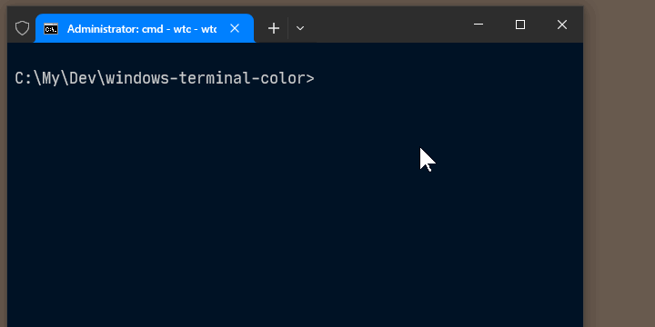

# Windows Terminal Color (wtc.cmd)



Open Windows Terminal with pseudo-random colors for tab and pane; based on the current directory.  
Same folder always gets the same unique colors.

## Installation

1. Download `wtc.cmd` into a permanent location
2. Run `wtc --install` to add the current folder to your user PATH
3. Restart your terminal

Or manually add the folder containing `wtc.cmd` to your PATH.

## Usage

```
wtc                          # open WT colored by current directory
wtc -d C:\Projects\foo       # specify a directory
wtc -- --title "My Tab"      # pass extra arguments to wt.exe
```

## Customization

Edit the `COLOR_COUNT` setting at the top of `wtc.cmd` (default `12`). This controls how many distinct colors are picked from the embedded 256-color palette. The colors are evenly spaced across the full hue spectrum regardless of the count.

To regenerate the color palette with different parameters:

```
node generate-colors.mjs
```

Edit `generate-colors.mjs` to change `numberOfColors`, `paneBackgroundDimming`, or `dimmingColor`, then paste the output from `colors.cmd` back into `wtc.cmd`.
